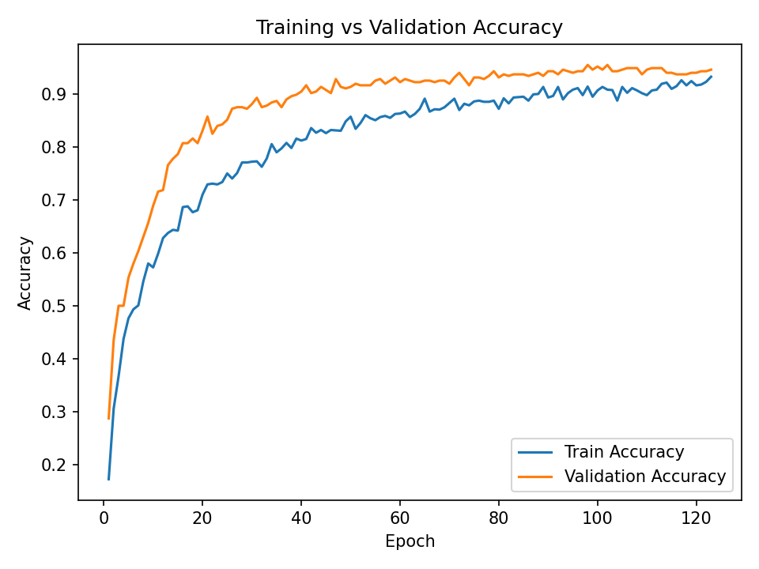
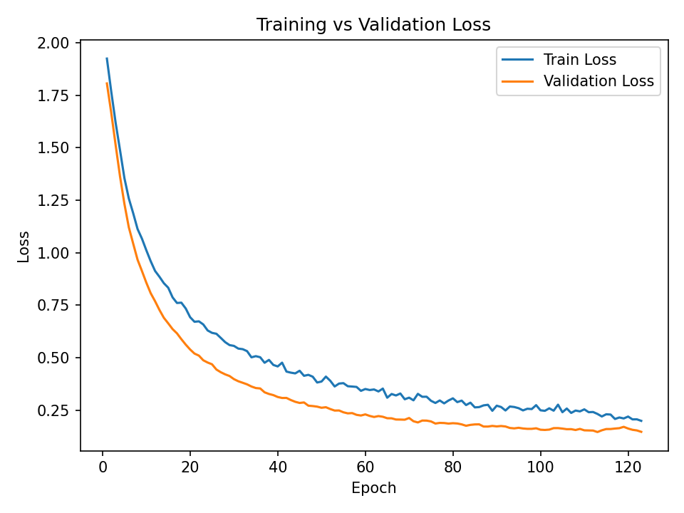

# Obesity Level Classification using Neural Network

## Overview

This project builds a neural network model to classify obesity levels using lifestyle and physical condition data.

This was conducted as part of a machine learning study project, focusing on understanding the full pipeline from data analysis to model training and evaluation.

---

## Dataset

Source: Kaggle  
https://www.kaggle.com/datasets/ruchikakumbhar/obesity-prediction/data

The dataset contains information such as:

- Age, Height, Weight
- Eating habits
- Physical activity
- Lifestyle behaviors

Target variable:

- Obesity level (7 classes)

Total samples: 2111  
Total features: 17  

---

## Model

Neural Network (MLP)

Structure:

- Dense (32, ReLU)
- Dropout (0.2)
- Dense (16, ReLU)
- Dropout (0.2)
- Dense (Softmax, 7 classes)

Training settings:

- Optimizer: Adam
- Loss: sparse_categorical_crossentropy

---

## Results

Test Accuracy: **96%**

Training results:

### Accuracy

### Loss

---

## Team Contributions

- Model implementation and training: Neural network design, training, and evaluation
- Data analysis (EDA): Dataset exploration and visualization

---

## Tech Stack

- Python
- Pandas
- Scikit-learn
- TensorFlow / Keras
- Matplotlib

---

## Notes

This project was conducted as part of a machine learning study group to practice data analysis and model implementation.
